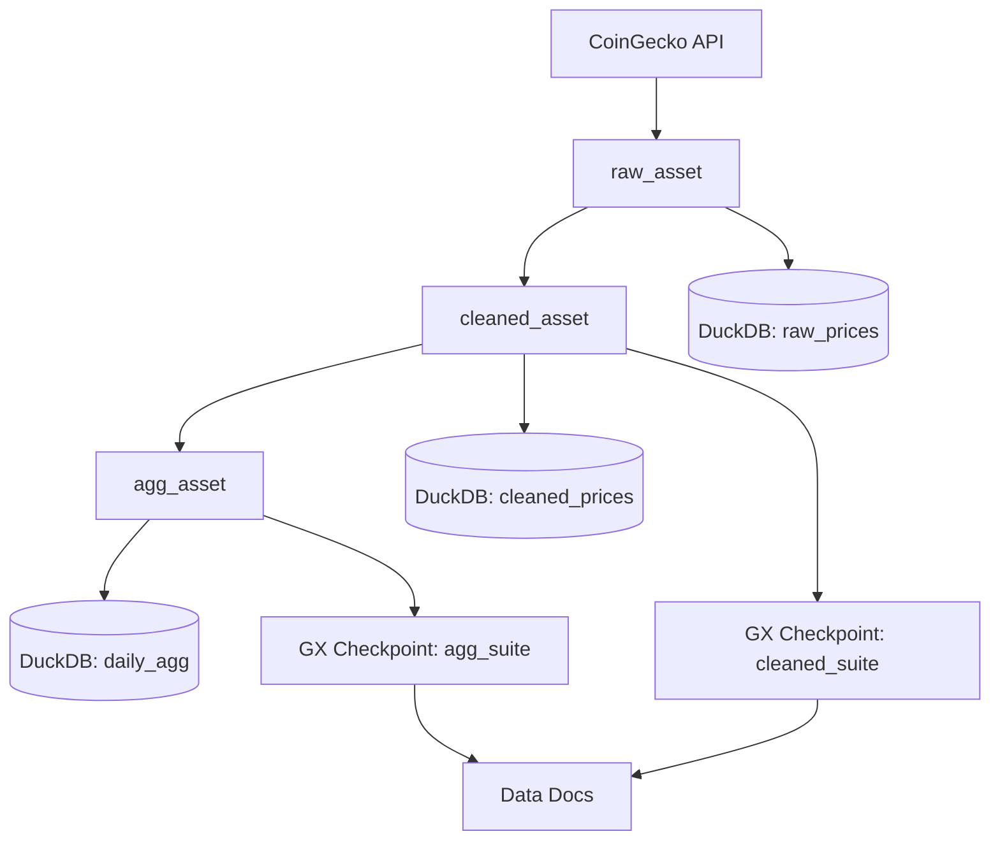

# dagster-gx-pipeline

Local Dagster + Great Expectations pipeline that ingests daily Bitcoin market data from CoinGecko, stages raw/cleaned/aggregated datasets in DuckDB, and publishes data quality docs.

## Architecture



## Repo layout

```
./pipeline        Dagster assets, GX runner, report generator
./expectations    Great Expectations config + expectation suites
./data            DuckDB + sample API payload
./reports         Validation output + markdown run report + data docs
./tests           Pytest coverage (deterministic mode)
```

## Local setup

```bash
python -m pip install -e .[dev]
```

### Start Dagster UI

```bash
make dev
```

### Materialize assets

```bash
make run
```

Run a deterministic materialization (uses the sample payload):

```bash
dagster job execute -f pipeline/definitions.py -j daily_job --partition=2024-05-01 --config-json '{"ops":{"raw_asset":{"config":{"deterministic":true}}}}'
```

### Run Great Expectations validations

```bash
make validate
```

### Build a markdown report

```bash
make report
```

Data Docs will be written to `reports/data_docs/index.html` after `make validate`.

## Lineage + assets

Assets are defined using the Software-Defined Assets pattern with daily partitions. The job `daily_job` is scheduled nightly and can be backfilled through Dagster (`dagster asset backfill -f pipeline/definitions.py -a raw_asset -s 2024-05-01 -e 2024-05-07`). Asset checks enforce row counts and null thresholds, and metadata on outputs provides record counts and freshness policies for each asset.

## Deterministic mode + sample data

Tests run in deterministic mode by loading `data/sample_api_payload.json` and overriding the DuckDB path in a temporary directory. This keeps test runs stable and repeatable.

## Extending the pipeline

### Add a new asset

1. Define a new Dagster asset in `pipeline/assets.py`, reading from DuckDB or an upstream asset.
2. Add the asset to `pipeline/definitions.py` so it appears in the job and schedule.

### Add a new Great Expectations suite

1. Add a new suite JSON in `expectations/expectations` (mirror the schema checks, null checks, and ranges).
2. Update `pipeline/validate.py` to load the new table and call `run_checkpoint`.
3. Re-run `make validate` to generate updated Data Docs.

## CI

GitHub Actions runs ruff, mypy, and pytest for every pull request.
# dagster-gx-pipeline

Local Dagster + Great Expectations pipeline that ingests daily Bitcoin market data from CoinGecko, stages raw/cleaned/aggregated datasets in DuckDB, and publishes data quality docs.

## Architecture


## Repo layout

```
./pipeline        Dagster assets, GX runner, report generator
./expectations    Great Expectations config + expectation suites
./data            DuckDB + sample API payload
./reports         Validation output + markdown run report + data docs
./tests           Pytest coverage (deterministic mode)
```

## Local setup

```bash
python -m pip install -e .[dev]
```

### Start Dagster UI

```bash
make dev
```

### Materialize assets

```bash
make run
```

Run a deterministic materialization (uses the sample payload):

```bash
dagster job execute -f pipeline/definitions.py -j daily_job --partition=2024-05-01 --config-json '{"ops":{"raw_asset":{"config":{"deterministic":true}}}}'
```

### Run Great Expectations validations

```bash
make validate
```

### Build a markdown report

```bash
make report
```

Data Docs will be written to `reports/data_docs/index.html` after `make validate`.

## Lineage + assets

Assets are defined using the Software-Defined Assets pattern with daily partitions. The job `daily_job` is scheduled nightly and can be backfilled through Dagster (`dagster asset backfill -f pipeline/definitions.py -a raw_asset -s 2024-05-01 -e 2024-05-07`). Asset checks enforce row counts and null thresholds, and metadata on outputs provides record counts and freshness policies for each asset.

## Deterministic mode + sample data

Tests run in deterministic mode by loading `data/sample_api_payload.json` and overriding the DuckDB path in a temporary directory. This keeps test runs stable and repeatable.

## Extending the pipeline

### Add a new asset

1. Define a new Dagster asset in `pipeline/assets.py`, reading from DuckDB or an upstream asset.
2. Add the asset to `pipeline/definitions.py` so it appears in the job and schedule.

### Add a new Great Expectations suite

1. Add a new suite JSON in `expectations/expectations` (mirror the schema checks, null checks, and ranges).
2. Update `pipeline/validate.py` to load the new table and call `run_checkpoint`.
3. Re-run `make validate` to generate updated Data Docs.

## CI

GitHub Actions runs ruff, mypy, and pytest for every pull request.
