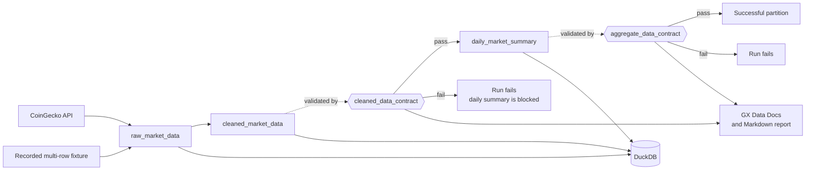

# Dagster + Great Expectations: Blocking Data Quality Gates

[](https://github.com/aelsaeed/Dagster-Pipeline-Great-Expectations-Quality-Gates/actions/workflows/ci.yml)


[](LICENSE)

A local-first data engineering project that ingests multi-row Bitcoin market data, materializes partitioned assets in DuckDB, and uses Great Expectations (GX) contracts as **blocking Dagster asset checks**.

The important behavior is observable, not implied: when `cleaned_data_contract` fails, Dagster fails the run and does not materialize the downstream aggregate. A deliberately bad fixture makes that failure path reproducible without relying on a live API.

## What this demonstrates

- A real daily-partitioned Dagster job, including lineage and run history.
- GX-backed checks surfaced in Dagster as `cleaned_data_contract` and `aggregate_data_contract`.
- Blocking quality gates that return non-zero status to local automation and CI.
- Deterministic passing and failing demos built from recorded multi-row fixtures.
- DuckDB-backed raw, cleaned, and daily aggregate layers.
- Partition-aligned live ingestion with payload validation and bounded retry behavior.
- Transactional partition replacement that makes deterministic reruns safe.
- Reproducible developer checks across Python 3.11–3.13.
- Inspectable Markdown reports and GX Data Docs uploaded by CI.

## Architecture


```mermaid
flowchart LR
    API[CoinGecko API] --> RAW[raw_market_data]
    FIXTURE[Recorded multi-row fixture] --> RAW

    RAW --> CLEAN[cleaned_market_data]
    CLEAN -. validated by .-> CLEAN_CHECK{{cleaned_data_contract}}
    CLEAN_CHECK -->|pass| AGG[daily_market_summary]
    CLEAN_CHECK -->|fail| BLOCKED[Run fails<br/>daily summary is blocked]

    AGG -. validated by .-> AGG_CHECK{{aggregate_data_contract}}
    AGG_CHECK -->|pass| COMPLETE[Successful partition]
    AGG_CHECK -->|fail| FAILED[Run fails]

    RAW --> DB[(DuckDB)]
    CLEAN --> DB
    AGG --> DB
    CLEAN_CHECK --> DOCS[GX Data Docs<br/>and Markdown report]
    AGG_CHECK --> DOCS
```

See [Architecture](docs/architecture.md) for component boundaries, execution paths, and design tradeoffs.

## Quickstart

Prerequisites: Git, Make, and Python 3.11, 3.12, or 3.13. Run commands from the repository root.

```bash
git clone https://github.com/aelsaeed/Dagster-Pipeline-Great-Expectations-Quality-Gates.git
cd Dagster-Pipeline-Great-Expectations-Quality-Gates
make setup
make demo
```

If `python3` is not one of the supported versions, select an installed interpreter explicitly,
for example `make setup BOOTSTRAP_PYTHON=python3.12`.

`make demo` executes a real Dagster partition with deterministic passing data. It does not call CoinGecko, so the result is repeatable in local development and CI.

Generated runtime output is isolated under `dagster-gx-pipeline/.artifacts/`:

- `reports/` — the latest human-readable run report and machine-readable summaries.
- `great_expectations/gx/` — GX's standard file context, validation results, and generated Data Docs.
- `data/` — the local DuckDB database and runtime data.

These artifacts are intentionally untracked. The CI workflow uploads the report and Data Docs for review on every run. The local Data Docs entry point is `dagster-gx-pipeline/.artifacts/great_expectations/gx/uncommitted/data_docs/local_site/index.html`.

## Prove the gate blocks bad data

```bash
make demo-failure
```

This command deliberately runs a fixture that violates the cleaned-data contract. The underlying Dagster job must fail at `cleaned_data_contract` and must not materialize `daily_market_summary`. The wrapper reports success only when it observes that expected failure; it fails if invalid data unexpectedly passes. See [Quality gates](docs/quality-gates.md) for the contract and failure semantics.

## Developer workflow

| Command | Purpose |
| --- | --- |
| `make setup` | Create `.venv` and install the project with development dependencies. |
| `make demo` | Run the deterministic passing partition and build evidence artifacts. |
| `make demo-failure` | Assert that invalid data makes the underlying job fail and blocks the daily summary. |
| `make dev` | Start the Dagster UI for lineage, checks, partitions, and run inspection. |
| `make check` | Run the repository's automated code and test checks. |
| `make clean` | Remove generated runtime output and local tool caches. |

For recovery steps and common local issues, see the [Runbook](docs/runbook.md).

## Quality contracts

| Check | Evaluated asset | Responsibility | Blocking effect |
| --- | --- | --- | --- |
| `cleaned_data_contract` | `cleaned_market_data` | Validate exact schema, minimum row count, timestamp uniqueness, required values, and positive numeric domains. | Failure prevents `daily_market_summary` from materializing. |
| `aggregate_data_contract` | `daily_market_summary` | Validate the one-row summary, observation count, positive domains, and `min <= average <= max`. | Failure marks the partition run unsuccessful. |

GX produces detailed validation evidence, while Dagster owns orchestration and downstream blocking. This keeps contracts independently readable without hiding the operational consequence of a failed check.

## Repository map

```text
.
├── dagster-gx-pipeline/
│   ├── src/dagster_gx_pipeline/  Assets, checks, GX contracts, fixtures, and reporting
│   ├── tests/                    Unit and real-materialization tests
│   └── .artifacts/               Generated data, reports, and GX output (ignored)
├── docs/
│   ├── architecture.md           Boundaries, sequence, and tradeoffs
│   ├── quality-gates.md          Contracts and blocking behavior
│   └── runbook.md                Demo operations and troubleshooting
├── scripts/                      Repeatable demo automation
└── .github/workflows/ci.yml      Automated checks and evidence artifacts
```

## Design choices

- **DuckDB keeps the demo evaluable.** It demonstrates persisted analytical layers and SQL inspection without requiring cloud infrastructure.
- **Recorded fixtures keep CI trustworthy.** The same multi-row inputs exercise transformations and contracts on every run; live API availability cannot create a false failure.
- **Checks are part of orchestration.** GX validation is exposed as blocking Dagster checks instead of a detached reporting step that runs after bad data has already propagated.
- **Passing and failing paths are both products.** A quality-gate project is only convincing when failure is easy to reproduce and inspect.

## Scope

This repository is an intentionally local, portfolio-scale reference implementation. It does not claim to be a hosted production platform. The [roadmap](ROADMAP.md) separates the demonstrated baseline from future work such as warehouse-backed storage, richer telemetry, alerting, and deployed schedules.

## Documentation

- [Package guide](dagster-gx-pipeline/README.md)
- [Architecture](docs/architecture.md)
- [Quality gates](docs/quality-gates.md)
- [Operations runbook](docs/runbook.md)
- [Roadmap](ROADMAP.md)
- [Changelog](CHANGELOG.md)
- [Contributing](CONTRIBUTING.md)

## License

Released under the [MIT License](LICENSE).
