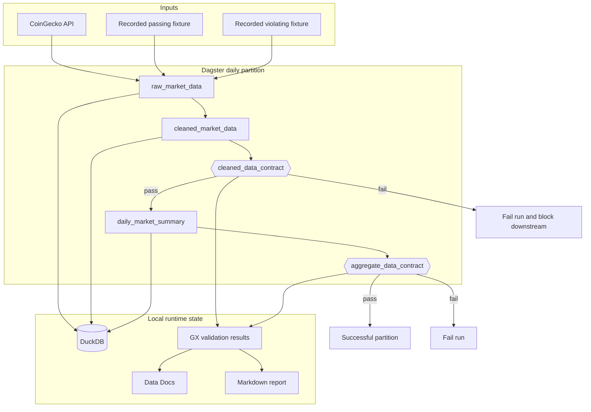

# Architecture

## Objective

The project demonstrates a narrow but important platform guarantee: data that violates an explicit contract must not silently propagate to a downstream aggregate.

Dagster owns partitions, execution order, lineage, and blocking behavior. Great Expectations owns the detailed data contracts and human-readable validation evidence. DuckDB provides a zero-infrastructure analytical store suitable for an evaluator running the project locally.

## System context



## Successful execution

1. A real Dagster job starts for an explicit daily partition.
2. `raw_market_data` loads every observation supplied for that partition.
3. `cleaned_market_data` normalizes types and fields and persists the cleaned rows.
4. `cleaned_data_contract` evaluates the complete cleaned partition through GX.
5. Only a passing cleaned contract allows `daily_market_summary` to calculate daily metrics.
6. `aggregate_data_contract` validates the aggregate result.
7. The run completes and the demo publishes a Markdown summary plus GX Data Docs under `.artifacts/`.

The recorded passing fixture keeps this sequence stable in local development and CI. The live API is an input adapter, not a dependency of the deterministic test path.

## Failure execution

The failing fixture enters through the same assets as valid data; it does not bypass transformation logic or call a checker in isolation.

When GX reports that the cleaned contract failed, Dagster emits a failed `cleaned_data_contract` check result. Because that check is blocking, `daily_market_summary` is not materialized for the partition and the job exits unsuccessfully. This gives the failure three useful forms of evidence:

- an operational signal through the process exit status;
- an orchestration signal in the Dagster run and asset-check history;
- a diagnostic signal in GX validation output and Data Docs.

See [Quality gates](quality-gates.md) for the exact ownership boundary.

## Component responsibilities

| Component | Owns | Does not own |
| --- | --- | --- |
| Dagster definitions | Asset graph, partitions, job construction, schedules, and check registration. | The detailed expectation vocabulary. |
| Pipeline assets | Partition-aligned source normalization, transformations, aggregation, persistence, and output metadata. | Deciding that a failing contract may be ignored. |
| GX integration | Executing versioned suites and returning structured validation results. | Orchestration order or downstream selection. |
| Dagster asset checks | Translating GX success into visible, blocking pipeline behavior. | Duplicating each expectation in Python. |
| DuckDB | Local persisted raw, cleaned, and aggregate tables. | Distributed concurrency or cloud durability. |
| Report builder | Summarizing the partition, row counts, and contract status for people and CI. | Converting failures into successes. |

## Runtime boundaries

Version-controlled inputs and contracts remain separate from generated state:

```text
dagster-gx-pipeline/
├── src/dagster_gx_pipeline/
│   ├── fixtures/         Recorded source fixtures
│   └── quality.py        Versioned GX contract definitions
└── .artifacts/
    ├── data/             Runtime DuckDB and derived data
    ├── reports/          Run summaries
    └── great_expectations/gx/
        └── uncommitted/data_docs/local_site/
```

GX creates its standard `gx` context inside the configured `great_expectations` project directory. This boundary makes `make clean` predictable and prevents evaluator runs from dirtying the Git working tree.

## Design decisions and tradeoffs

### Blocking checks over post-run validation

A separate validation command can describe bad data after downstream assets have already consumed it. A blocking asset check keeps GX's diagnostic detail while making data quality part of Dagster's execution semantics.

### Deterministic fixtures over a mandatory live dependency

Recorded multi-row inputs let CI verify transformations, aggregation, and both contract outcomes without API rate limits or upstream changes. The tradeoff is that fixture coverage must be maintained deliberately as the source schema evolves.

### DuckDB over external infrastructure

DuckDB makes the full flow inspectable on a laptop and keeps the review cost low. It is not presented as a substitute for a concurrent production warehouse. The asset and contract boundaries provide the seam for a future storage adapter.

### Filesystem evidence over an always-on dashboard

Markdown and Data Docs are portable, reviewable CI artifacts. They do not provide long-term telemetry or alerting; those are explicit roadmap items.

## Production evolution

The implementation already performs structural source validation, bounded transient retries, partition/timestamp reconciliation, and transactional partition replacement. The next production-oriented steps would add a versioned typed source contract, coordination for concurrent backfills, durable artifact storage, deployed schedules, quality trend metrics, and alert routing. Those extensions should preserve the demonstrated invariant: a failed cleaned-data contract blocks downstream aggregation.
